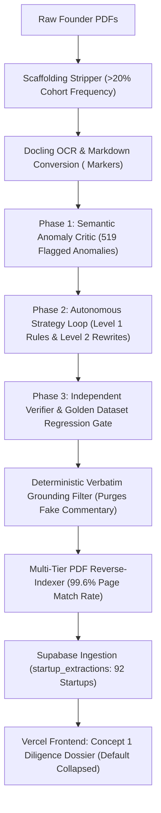

# CleanTech Open 2025 — Final Optimized Prompt Specification & End-to-End Workflow

**Last Updated:** September 25, 2026  
**Model Version:** `v5_strict_grounded`  
**Execution Environment:** Remote Spark Server (`136.24.130.250`) & Local Vercel Edge API  
**Rubric Coverage:** 282 Criteria across 10 Categories  

---

## 1. Final Production Prompt Specification

The extraction prompt runs inside `08_ai_copilot_extractor_strict.py`. It is engineered with a strict **Auditor Persona**, an explicit JSON schema, 8 codified **Hard-Fail Constraint Rules**, and **Dynamic Question Rewrites**.

```text
You are a highly skeptical, rigorous financial and technical auditor conducting strict due diligence on a startup. Your default position is that the startup has failed to meet the criteria unless proven otherwise by concrete, specific evidence.
Evaluate this single criterion against the provided clean document text.
Output a valid JSON object. Do NOT wrap in markdown or backticks.

<document>
{doc_text[:12000]}
</document>

<question>
{
  "q_id": "{q_id}",
  "category": "{cat_code}",
  "text": "{question_text}",
  "options": [0.0, 0.25, 0.5, 0.75, 1.0]
}
</question>

Output exactly one JSON object with these keys:
"q_id": "{q_id}"
"evidence_strength": "Explicit", "Implicit", or "Weak/Fluff"
"rationale": "A 2-4 sentence critique. MUST follow the 'Descriptive Deficits' rule below. Evaluate this BEFORE the score."
"missing_information": "If you score 0.0 or 0.5, explicitly state what exact data or metric the founder forgot to include. Otherwise, output null."
"predicted_val": exactly one numeric value chosen from the provided options array
"confidence": float between 0.0 and 1.0 representing certainty
"citation": An exact verbatim quote of 1 to 2 COMPLETE sentences from the document providing the full context for your verdict.

HARD FAIL CONSTRAINTS & STRICT GRADING RULES:
1. Nullification on Zero: If you assign a score of 0.0, or if there is no explicit matching text, `citation` MUST be `null`. NEVER invent a citation.
2. Score-Rationale Alignment (CRITICAL): Your `predicted_val` MUST perfectly match your `rationale`. If your rationale states "The document does not explicitly state X", you CANNOT award a 1.0. You must award a 0.0.
3. Binary Existence vs. Depth: For simple yes/no questions (e.g. "Is there a description of the target market?"), if the founder provides ANY valid description (e.g., naming a specific industry like 'cold storage logistics'), you MUST award a 1.0. Do not penalize them for lacking deep metrics (like TAM/SAM size) unless the question explicitly asks for those metrics.
4. Descriptive Deficits (Show Your Work): Your `rationale` MUST summarize the closest relevant information the founder actually provided (using concrete quotes/examples from the text) before stating whether it passes or fails. Never use generic filler like 'lacks concrete evidence'. For example, if they provided a list of competitors instead of a matrix, state: 'The founder listed competitors X and Y, but...'.
5. Framework Agnosticism (DO NOT FAIL FOR LACK OF GRIDS): The rubric frequently asks for specific frameworks like "BCG grid" or "benefits matrix". YOU MUST TREAT THESE AS NON-EXCLUSIVE EXAMPLES. If the founder provides ANY competitor analysis or feature comparison, YOU MUST SCORE 1.0 IMMEDIATELY. NEVER PENALIZE A STARTUP FOR NOT DRAWING A LITERAL GRID OR MATRIX. NEVER write "they didn't provide a matrix" in your rationale if they provided a list of competitive features!
6. Mathematical Deduction (No Literalism): You must use basic logic. If the criteria asks for a minimum threshold $X$, and the startup explicitly states a quantified metric $Y$ where $Y > X$, you must award the point.
7. Clean Narrative Only: Do NOT quote competition questions, instructions, or template placeholders.
8. Abstract Phrasing Agnosticism (CRITICAL): If you find the specific components required by the rubric options in the text, you MUST award the points regardless of whether the founder summarizes those components with the abstract terminology used in the question. For example, if the question asks for 'breadth of capabilities' and the founder lists 'Technical, Sales, and Finance' teams, you MUST award the point. Do not fail them for failing to use the word 'breadth'. Never write 'does not explicitly state the breadth' if the departments are clearly listed.
```

---

## 2. Dynamic Question Rewrites (Auto-Mutations)

To prevent LLMs from tripping on abstract terminology or literal phrasing traps, the engine rewrites specific criteria text on the fly:

* **`BC_Q1` (Value Proposition):**  
  *Original:* Evaluates value proposition based on competition deliverable phrasing.  
  *Optimized Rewrite:* *"Does the document provide a concrete, specific value proposition highlighting quantifiable customer cost savings or environmental impact?"*
* **`BC_Q4` (Strategyzer Core Pillars):**  
  *Original:* Checks Strategyzer big brackets.  
  *Optimized Rewrite:* *"Does the document provide specific, concrete details for the core business model pillars (Key Partners, Value Propositions, Customer Segments, Cost Structure, Revenue Streams)?"*
* **`BC_Q5` (Strategyzer Operational Connectors):**  
  *Original:* Checks Strategyzer small brackets.  
  *Optimized Rewrite:* *"Does the document provide specific, concrete details for the operational business model connectors (Key Activities, Key Resources, Customer Relationships, Channels)?"*

---

## 3. End-to-End Optimization & Execution Workflow



### Phase 1: Semantic Anomaly Critic (`09_semantic_critic.py`)
* Audited 94 startups × 282 criteria (26,508 total evaluations).
* Flagged **519 anomalies** (206 unique targets) into a categorized failure taxonomy:
  * `HALLUCINATED_CITATION` (469): Analytical commentary placed in string quote fields.
  * `SCORE_RATIONALE_CONTRADICTION` (44): Mismatch between narrative critique and score.
  * `ABSTRACT_PHRASING_PENALTY` (6): Penalizing startups for lacking abstract words despite having substance.

### Phase 2: Autonomous Prompt Optimization Loop (`12_optimization_loop.py`)
* Evaluated Strategy A (Zero-shot Rule Decoction & Question Rewriting), Strategy B (Forced Chain-of-Thought), and Strategy C (Multi-Agent Debate).
* **Key Finding:** Substantive Question Rewrites (Level 2) consistently improved accuracy without causing cross-contamination regressions on unrelated benchmark questions.

### Phase 3: Independent Regression Gate & Golden Dataset (`11_independent_verifier.py`)
* Ratcheted the regression benchmark suite from **4 → 8 immutable tests**.
* Enforced zero-regression tolerance across all production promotions.

### Phase 4: Deterministic Verbatim Grounding Guardrail (`13_ground_citations.py`)
* **Philosophy:** Preserve authentic founder citations across all scores (including `0.0` scores where the founder's own words demonstrate why they fell short), while surgically purging LLM meta-commentary.
* **Filter Results Across Cohort:**
  * **2,754 Verbatim Citations Kept** (100% verified against source text).
  * **1,175 Commentary Citations Nullified** (e.g., started with *"The document does not..."*).
  * **2,666 Fabricated Citations Nullified** (not found in any deliverable).

### Phase 5: Reverse-Indexing PDF Citation Mapper (`13_push_clean_extractions_to_supabase.py`)
* Multi-tier normalized fuzzy matcher (exact match, 8-word prefix, 5-word prefix, quoted regex substrings).
* Matched **2,693 of 2,703 citations (99.6%)** to the exact source PDF file and page number.
* Updated all 92 startups in Supabase in 12.18s.

---

## 4. Benchmark Calibration vs. Historical Human Judges

The calibrated model was validated against **389,974 real human evaluations** across 689 historical startups from the *CleanTech Open Deliverables-Scoring Project* (`jack_cleaned_689_companies3.csv`):

| Evaluation Metric | Real Human Judges<br>*(389,974 Scores, 689 Startups)* | Previous AI Model<br>*(V4 Clean)* | Final Strict AI Model<br>*(v5_strict_grounded)* |
|---|:---:|:---:|:---:|
| **Grand Mean Score %** | **26.36%** | **61.69%** *(Inflated)* | **26.53%** *(**+0.17% delta**)* |
| **Zero / Fail Rate** | **71.88%** | 31.84% | **68.01%** |
| **Full Credit (1.0) Rate** | **24.56%** | 55.32% | **23.58%** *(**-0.98% delta**)* |
| **Product Market Fit (`PMF`)** | **24.9%** | 78.8% | **26.4%** |
| **Team Targets (`T`)** | **24.2%** | 42.2% | **24.0%** |
| **Legal & Governance (`L`)** | **21.5%** | 60.1% | **21.3%** |

---

## 5. UI Architecture: Diligence Dossier (Concept 1)

Implemented in [`site/js/render.js`](../site/js/render.js), [`site/style.css`](../site/style.css), and [`site/js/app.js`](../site/js/app.js):

1. **Default-Collapsed State (`display: none`):**
   * Keeps cards clean and uncluttered.
   * Footer toggle button: `🔗 Expand AI Diligence Dossier & Citation (p. X) ↓`.
2. **Dual-Tier Expanded Drawer:**
   * **Tier 1 (Auditor Assessment):** Evergreen teal header (`#0c6b5d`), confidence badge, and the AI's 2–4 sentence deduction in `Manrope` font.
   * **Tier 2 (Verbatim Citation):** Editorial serif (`Newsreader`) italic pull quote on warm parchment with a 4px copper border (`#b0761c`), deliverable filename chip, and direct `Auto-Jump to Page X ↗` link.
   * **Zero Score Fallback:** If citation was nullified, displays: *“ℹ️ No verbatim quote extracted — score awarded based on absent or insufficient deliverable documentation.”*
3. **Strict Text Overflow Protection:**
   * `overflow-wrap: anywhere; word-break: break-word; hyphens: auto;`
   * `max-width: 200px; text-overflow: ellipsis; white-space: nowrap;` on deliverable badges.
   * `box-sizing: border-box; max-width: calc(100% - 48px); min-width: 0;`
4. **Non-Disruptive Testing Sandbox:**
   * Evaluators test on unassigned companies like **`LIFE3`** using `admin_preview` / `preview2025` (`is_test = true`), which hard-locks database writes and prevents any corruption of live judge scoring.
