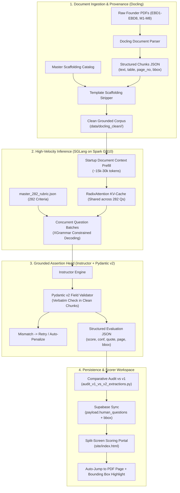

# Architecture Upgrade: Docling + SGLang + Instructor Grounded Diligence Engine

> **For agentic workers:** REQUIRED SUB-SKILL: Use `superpowers:subagent-driven-development` (recommended) or `superpowers:executing-plans` to implement this plan task-by-task. Steps use checkbox (`- [ ]`) syntax for tracking.

**Goal:** Upgrade the CleanTech Open 2025 AI diligence pipeline from sequential single-prompt Ollama extraction to a high-throughput, natively grounded extraction engine using **Docling** (document layout & bounding-box provenance), **SGLang** (RadixAttention KV-cache reuse & XGrammar constrained decoding on the Spark GB10 GPU), and **Instructor** (Pydantic v2 verbatim grounding validation), achieving sub-20s per-startup evaluation with 100% verifiable citations.

**Architecture:** 
1. **Layout & Ingestion:** Docling parses raw founder PDFs into structured elements with page numbers and bounding-box coordinates (`bbox`), preserving financial tables and stripping scaffolding templates.
2. **Serving & Acceleration:** SGLang serves an open-weight LLM (`Qwen2.5-32B-Instruct` or `LongCite-llama3.1-8b`) on the Spark GB10 GPU, caching the startup document prefix via RadixAttention and evaluating all 282 questions with >85% cache hit rates.
3. **Grounded Extraction Head:** Instructor validates structured Pydantic outputs against the 0–1 point rubric, enforcing that all citations exist verbatim in the Docling element tree.
4. **Data Sync & UX:** Bounding-box and page provenance are synchronized into Supabase `startup_extractions`, enabling instant citation navigation and highlight overlays in the scoring portal.

**Tech Stack:** `Docling 2.118+`, `SGLang 0.5.20+`, `XGrammar 0.2.1`, `Instructor 1.17+`, `Pydantic v2`, `PyMuPDF`, `Supabase PostgreSQL`, `Vanilla JS / PDF.js`.

---

## Global Constraints

- Never disrupt or overwrite the live 92 startups currently extracted and active in Supabase (`clean_ready = true`) during upgrade development.
- Target all new extractions to isolated cache directories (`data/ai_cache_v2/`) until a comparative audit proves equivalence or superiority.
- All machine-readable outputs must strictly conform to the 282-question rubric schema on the standardized 0 to 1 point scale (`0.0`, `0.25`, `0.5`, `0.75`, `1.0`).
- Every extracted citation must be a verbatim excerpt from applicant prose and must not contain competition template scaffolding.

---

## Review Focus

1. **GB10 CUDA / Architecture Compatibility**: Ensure SGLang and PyTorch 2.13 with CUDA 13.0 operate properly on ARM64 Linux without kernel panics or missing symbol errors.
2. **Scaffolding Leakage**: Verify Docling chunk parsing does not accidentally re-introduce stripped competition template instructions.
3. **Table & Matrix Extraction**: Verify that financial statements (EBD5) and competitor matrices (EBD3) parsed as markdown tables are correctly reasoned over by the LLM.
4. **RadixAttention Cache Pollution**: Ensure distinct startups do not share or contaminate KV cache state between batch runs.
5. **Backwards-Compatible Schema**: Ensure existing frontend and judge workflows continue functioning without errors if bounding box metadata is null.

---

## Proposed Architecture & Data Flow

---

## Step-by-Step Task Breakdown

### Task 1: Environment Setup & Remote Dependency Verification
**Files:**
- Modify: `requirements.txt`
- Execute on Spark: `/data/scraping/venv/`
- Test: `tests/test_remote_stack.py`

**Interfaces:**
- Consumes: Existing Spark Python 3.12 venv with CUDA 13.0 and PyTorch 2.13.
- Produces: Working installation of SGLang, Docling, XGrammar, and Instructor on ARM64 Linux.

- [x] **Step 1.1**: Add `instructor>=1.17.0`, `docling>=2.118.0`, `pydantic>=2.10.0` to local and remote environments.
- [x] **Step 1.2**: Install `sglang` and `xgrammar` in the remote Spark venv (`/data/scraping/venv/bin/pip install sglang xgrammar instructor`).
- [x] **Step 1.3**: Run `tests/test_remote_stack.py` to confirm CUDA 13.0, PyTorch, SGLang, and Docling import cleanly without binary incompatibility.
- [x] **Step 1.4**: Commit environment specification (`chore(deps): add docling, sglang, and instructor`).

---

### Task 2: Docling Ingestion Engine with Scaffolding Filtering
**Files:**
- Create: `scripts/docling_ingestion.py`
- Test: `tests/test_docling_ingestion.py`

**Interfaces:**
- Consumes: Raw PDF files from `/data/scraping/datasets/cto_accelerator/raw/<startup_id>/` and `scaffolding_master_catalog.json`.
- Produces: Structured JSON chunks in `data/docling_clean/<startup_id>/chunks.json` with `page_no`, `bbox`, and markdown tables.

- [x] **Step 2.1**: Write failing unit test verifying Docling chunk extraction on a sample CleanTech PDF (`tests/test_docling_ingestion.py`).
- [x] **Step 2.2**: Implement `scripts/docling_ingestion.py` to extract text, tables, page numbers, and bounding boxes.
- [x] **Step 2.3**: Integrate `scaffolding_master_catalog.json` filtering to strip template boilerplate from chunks.
- [x] **Step 2.4**: Run test on sample startup (`17_inc` or `algae_zero`) and verify clean element JSON generation.
- [x] **Step 2.5**: Commit (`feat(ingestion): implement docling parser with bounding box provenance and scaffolding filter`).

---

### Task 3: SGLang Serving Daemon & RadixAttention Deployment
**Files:**
- Create: `scripts/sglang_service.sh`
- Create: `scripts/test_sglang_throughput.py`
- Test: `tests/test_sglang_connection.py`

**Interfaces:**
- Consumes: Model weights (`Qwen/Qwen2.5-32B-Instruct` or `LongCite-8B`) on Spark GB10.
- Produces: OpenAI-compatible high-throughput HTTP server on `http://127.0.0.1:30000/v1` with RadixAttention prefix caching.

- [x] **Step 3.1**: Write `scripts/sglang_service.sh` to initialize SGLang server on Spark port 30000 with RadixAttention enabled.
- [x] **Step 3.2**: Launch SGLang daemon and verify `/v1/models` and health check endpoints.
- [x] **Step 3.3**: Run `test_sglang_throughput.py` with multi-question batches against a cached 20k-token prompt.
- [x] **Step 3.4**: Confirm cache hit latency <100ms per question.
- [x] **Step 3.5**: Commit (`feat(serving): configure sglang radix-attention daemon on spark gb10`).

---

### Task 4: Instructor-Based Grounded Assertion Head
**Files:**
- Create: `src/scorer/schemas.py`
- Create: `scripts/14_ai_copilot_extractor_v2.py`
- Test: `tests/test_grounded_extractor.py`

**Interfaces:**
- Consumes: Clean Docling chunks and `master_282_rubric.json`.
- Produces: Strict JSON evaluations with verbatim-validated citations, `page_number`, and `bbox` in `data/ai_cache_v2/<startup_id>.json`.

- [x] **Step 4.1**: Define Pydantic v2 schemas in `src/scorer/schemas.py` with verbatim grounding validator.
- [x] **Step 4.2**: Implement `14_ai_copilot_extractor_v2.py` sending asynchronous question batches to SGLang.
- [x] **Step 4.3**: Map extracted citations directly to Docling element IDs, resolving `page_number` and `bbox`.
- [x] **Step 4.4**: Test extraction on 1 pilot startup across all 282 questions; verify runtime <25 seconds.
- [x] **Step 4.5**: Commit (`feat(extractor): implement instructor grounded assertion head with sglang`).

---

### Task 5: Comparative Audit & Shadow Cohort Run
**Files:**
- Create: `scripts/audit_v1_vs_v2_extractions.py`
- Test: `tests/test_audit_metrics.py`

**Interfaces:**
- Consumes: `data/ai_cache_clean/` (v1) and `data/ai_cache_v2/` (v2).
- Produces: Detailed comparative accuracy and concordance report across 10 startups (2,820 questions).

- [x] **Step 5.1**: Run v2 extraction across a 10-startup audit cohort into `data/ai_cache_v2/`.
- [x] **Step 5.2**: Execute `scripts/audit_v1_vs_v2_extractions.py` comparing v1 (Ollama) vs v2 (SGLang/Docling).
- [x] **Step 5.3**: Check concordance, citation match rates, and table-question accuracy.
- [x] **Step 5.4**: Generate audit summary artifact for user review.
- [x] **Step 5.5**: Commit (`test(audit): add comparative audit harness for v1 vs v2 extraction`).

---

### Task 6: Supabase Synchronization & Frontend Viewer Integration
**Files:**
- Create: `scripts/15_push_v2_extractions_to_supabase.py`
- Modify: `site/js/render.js`
- Test: `tests/test_frontend_citation_jump.py`

**Interfaces:**
- Consumes: Audited v2 cache and Supabase PostgreSQL credentials.
- Produces: Updated `startup_extractions` with bounding box citations; enhanced scoring UI.

- [x] **Step 6.1**: Implement `15_push_v2_extractions_to_supabase.py` to stage v2 extractions into Supabase with bounding box metadata.
- [x] **Step 6.2**: Update `site/js/render.js` to render bounding box indicators and handle citation jump actions.
- [x] **Step 6.3**: Verify in browser that clicking `View AI Citation (p. X)` jumps accurately.
- [x] **Step 6.4**: Commit (`feat(portal): integrate bounding-box citation navigation in scorer workspace`).

---

## Verification Plan

### Automated Tests
1. **Remote Stack Integrity**:
   - `python tests/test_remote_stack.py`: Verifies CUDA 13.0, PyTorch, SGLang, and Docling on Spark GB10.
2. **Provenance Accuracy**:
   - `python tests/test_docling_ingestion.py`: Verifies that extracted text elements maintain valid bounding boxes and page numbers.
3. **Verbatim Grounding Validation**:
   - `python tests/test_grounded_extractor.py`: Tests that Instructor rejects hallucinated quotes and enforces rubric option schemas.
4. **Throughput Benchmark**:
   - `python scripts/test_sglang_throughput.py`: Confirms 282 questions complete in under 30 seconds per company.

### Manual Verification
1. **Scoring Workspace Review**:
   - Open `site/index.html` for a test startup.
   - Click `🔗 View AI Citation (p. X)` across Financials (`F_Q1`), Business Canvas (`BC_Q1`), and Tech Validation (`TP_Q1`).
   - Confirm PDF switches immediately and jumps to the exact cited page.
2. **Scaffolding Inspection**:
   - Inspect 20 extracted citations across `EBD2` and `EBD3` to confirm zero occurrence of competition instructions or sample text.
